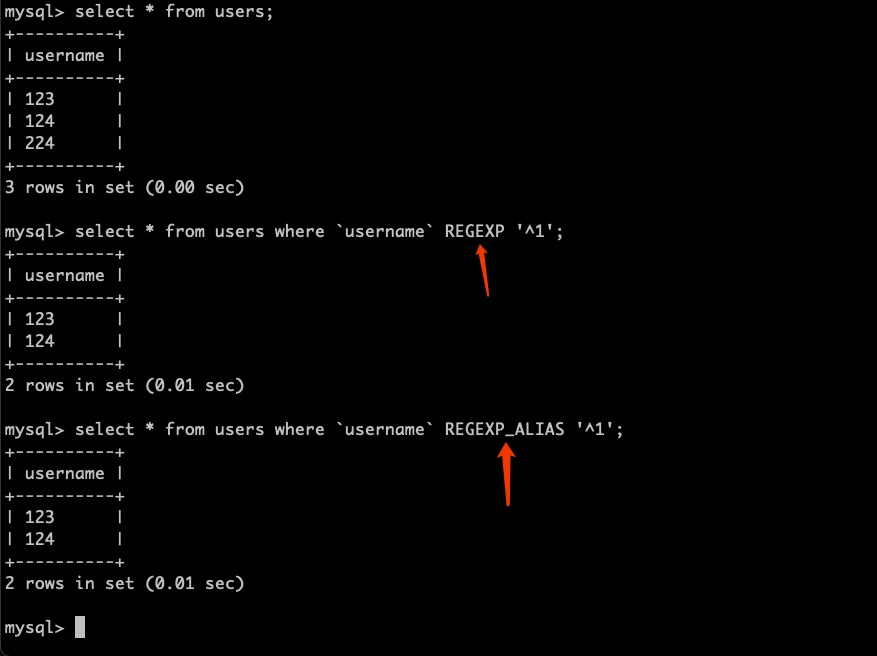

# Mysql System Lex Alias

English | [简体中文](./i18n/README.zh-cn.md)

Add an alias for your Mysql system reserved fields

[DockerHub Repositorie](https://hub.docker.com/r/shencangsheng/mysql-system-lex-alias)

- [Mysql System Lex Alias](#mysql-system-lex-alias)
  - [How to use for your](#how-to-use-for-your)
    - [Download Mysql Server Source Code](#download-mysql-server-source-code)
    - [Add an Alias to Mysql System Lex](#add-an-alias-to-mysql-system-lex)
    - [Compile Mysql Server Source Code](#compile-mysql-server-source-code)
    - [Effect](#effect)
  - [License](#license)

## How to use for your

### Download Mysql Server Source Code

```bash
wget https://codeload.github.com/mysql/mysql-server/zip/refs/heads/5.7
unzip 5.7
```

### Add an Alias to Mysql System Lex

```bash
docker run --rm -v $(pwd)/mysql-server-5.7:/mysql-server-5.7 shencangsheng/mysql-system-lex-alias:latest add-lex-alias -f /mysql-server-5.7 -c REGEXP -v REGEXP_ALIAS
```

### Compile Mysql Server Source Code

- **[ advice ]** Build based on multiple segments, quickly.

```bash
docker build --target compile --target compile-builder -t ${username}/mysql:latest .
```

- **[ deprecated ]** Based on the mount, Compile the slow, Output compression package.

```bash
docker run --rm -v $(pwd)/mysql-server-5.7:/usr/local/mysql-server -v $(pwd)/output:/output shencangsheng/mysql-source-compile:latest package-mysql
docker build --target copy-builder -t ${username}/mysql:latest .
```

### Effect

<p align="center">

</p>

## License

A short snippet describing the license (MIT)

MIT © Cangsheng Shen
